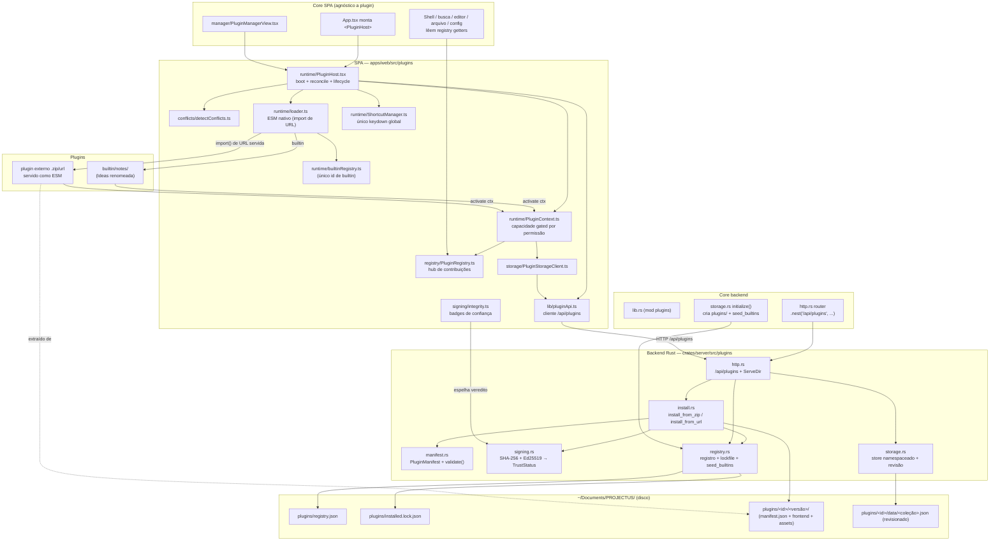

# Arquitetura de plugins

PROJECTUS tem um sistema de plugins de duas metades: um subsistema no backend Rust
(o escritor durável e a autoridade de verificação) e um host na SPA React (que
carrega, ativa e renderiza as contribuições). O princípio de ouro é **anti-espaguete**:
nenhum arquivo do core nomeia um plugin específico. O core consome um registro de
contribuições; os plugins nomeiam as superfícies do host, nunca o contrário.

Esta página é o mapa de módulos e o desenho de blocos. Para escrever um plugin veja
[autoria-de-plugins.md](autoria-de-plugins.md); para entender por que Notes existe
como plugin nativo veja [notes-como-plugin.md](notes-como-plugin.md).

## Princípios

- **O core nunca nomeia um plugin.** Shell, App, busca global, editor, configurações
  e arquivo leem o `PluginRegistry`; nunca importam um builtin nem um loader concreto.
  O único lugar onde um id de builtin aparece no frontend é `runtime/builtinRegistry.ts`;
  no backend é `registry::seed_builtins` (e ele introduz o builtin **como dado**, não
  como código acoplado).
- **O backend é o único escritor durável e a autoridade de verificação.** Toda escrita
  passa por `Storage` sob o mutex global de escrita. SHA-256 é a checagem de
  integridade obrigatória; MD5 nunca é aceito. Assinatura é Ed25519 sobre o manifesto.
- **Código externo é carregado com o loader ESM nativo** (`import()` de uma URL servida
  pelo host). Nunca `eval`, nunca `new Function`, nunca um blob construído a partir de
  texto-fonte.
- **Reuso de primitivas.** As contribuições reusam os tipos do editor Lexical, os tipos
  da busca global e o `Locale`/`Dictionary` do i18n. Nenhum componente de editor novo,
  nenhuma dependência npm nova no frontend.

## Mapa de módulos — backend (`crates/server/src/plugins/`)

| Módulo | Papel |
| --- | --- |
| `mod.rs` | Fachada do subsistema. Reexporta o contrato (manifesto, integridade/assinatura, registro + lockfile, pipelines de instalação, store de dados, router `/api/plugins`). Documenta que o core nunca nomeia um plugin. |
| `manifest.rs` | O `PluginManifest` (`manifest.json`) e o `validate()` — o único portão de schema que toda instalação executa. Os vocabulários conhecidos (`Permission`, `Interaction`, `ExtensionPoint`) são enums, então um manifesto só pode declarar capacidades que o host entende. |
| `signing.rs` | Integridade + confiança. `verify_package` (SHA-256 sobre os bytes do pacote) e `verify_signature` (Ed25519 sobre os bytes do manifesto) colapsam num único `TrustStatus`. `TrustedPublishers` é a cadeia de confiança (scaffold: hoje confia em ninguém por padrão). |
| `registry.rs` | O registro de plugins instalados (`plugins/registry.json`) e o lockfile de integridade (`plugins/installed.lock.json`). `seed_builtins` semeia o Notes builtin como dado. `set_state` recusa ativar um plugin com integridade `mismatch`. |
| `install.rs` | Os pipelines de instalação: `install_from_zip` (upload) e `install_from_url` (download). Ambos funilam por `install_package`, que aplica o mesmo portão em ordem (extrair → validar manifesto → conferir SHA-256 → conferir assinatura → exigir `allow_unsigned` para pacotes sem assinatura → gravar a árvore + upsert no registro). Protege contra zip-slip e download gigante. |
| `storage.rs` | O store de dados namespaceado e revisionado por plugin (`plugins/<id>/data/<coleção>.json`). Mesma disciplina de concorrência otimista do resto do PROJECTUS (read-revision / write-revision / `409`). Os wrappers em `impl Storage` passam pelo mutex global de escrita. |
| `http.rs` | A superfície HTTP `/api/plugins`: listar, instalar (zip + url), enable/disable/uninstall, `verify`, CRUD de dados e o `ServeDir` que serve a árvore extraída de cada plugin como assets estáticos. |

Integração com o core do backend:

- `lib.rs` declara `pub mod plugins;`.
- `http.rs` (core) faz `.nest("/api/plugins", crate::plugins::http::router(...))` e serve
  os assets dos plugins via o `ServeDir` interno do router.
- `storage.rs::initialize()` cria `plugins/` junto de `projetos/`, `lixeira/`, `arquivo/`
  e `notes/`, e chama `crate::plugins::registry::seed_builtins(&self.root)`.

## Mapa de módulos — SPA (`apps/web/src/plugins/`)

| Caminho | Papel |
| --- | --- |
| `index.ts` | A superfície pública (barrel). O resto do app só toca o sistema de plugins por aqui: monta `<PluginHost>`, lê o registro vivo via `useRegistry`/`usePluginHost`, consome os tipos de contribuição. Plumbing interno (loader, sandbox, contexto) não é reexportado. |
| `types/manifest.ts` | Espelho TypeScript do `PluginManifest` Rust. A autoridade de validação é o Rust; este tipo dá ao frontend uma visão fiel do documento que chega por `/api/plugins`. |
| `types/permissions.ts` | O vocabulário fechado de permissões (`PermissionId`) + guarda `isPermissionId`. |
| `types/interactions.ts` | O vocabulário fechado de superfícies do host (`InteractionId`) que um plugin declara via `interacts_with`. |
| `types/extension-points.ts` | Os tipos de contribuição — um por ponto de extensão (nav, screen, settings, editor, busca, cards, arquivo, comandos, atalhos, jobs, i18n). É o contrato entre as duas metades. |
| `registry/PluginRegistry.ts` | O hub de des-hardcode: um store keyed por tipo de contribuição. `register*` adicionam, `unregisterPlugin(id)` remove tudo de um plugin, getters retornam um snapshot imutável e ordenado. React assina via `subscribe`. |
| `registry/useRegistry.ts` | O binding React (`useSyncExternalStore`) sobre o registro. |
| `runtime/PluginHost.tsx` | O provider que dá boot e roda o subsistema: busca a lista do backend, roda `detectConflicts`, carrega + ativa cada plugin habilitado e não-conflitante, mantém o `ShortcutManager` em sincronia, e expõe `enable`/`disable`/`refresh` sem restart. |
| `runtime/loader.ts` | Carrega o módulo ESM de um plugin. Builtins resolvem por `builtinRegistry`; externos por `import()` da URL servida (`@vite-ignore`). Seam de sandbox (`DirectModuleSandbox` hoje; `IframeSandbox` é stub futuro). Nunca `eval`. |
| `runtime/builtinRegistry.ts` | O único lugar do frontend que nomeia um id de builtin: `notes: () => import('../builtin/notes')`. Vite faz code-split de cada builtin. |
| `runtime/PluginContext.ts` | O objeto de capacidade entregue a `activate(ctx)`. Registrars escopados (cada um carimba o `pluginId` e é gated por permissão) + i18n + atalhos + store namespaceado. |
| `runtime/ShortcutManager.ts` | O dono do **único** listener global de keydown para atalhos de plugin. Política de colisão alinhada ao detector; acelaradores nativos (`mod+k`, `mod+n`) são reservados. Substitui o antigo padrão `window.addEventListener`. |
| `conflicts/detectConflicts.ts` | Detector puro: integridade `mismatch` (fatal), API muito nova (fatal), conflito declarado (fatal), permissão desabilitada (fatal), e colisões de atalho/screen/slot/nó de editor (warning). A baseline nativa é injetada, nunca hard-coded. |
| `permissions/checkPermission.ts` | O portão de permissão (`assertPermission`/`hasPermission`) que cada registrar do contexto executa. |
| `signing/integrity.ts` | Espelho de exibição do `TrustStatus` (badges/tons) + helper SHA-256 via WebCrypto. Nunca decide confiança — só mostra o veredito do backend. Nunca MD5. |
| `storage/PluginStorageClient.ts` | Cliente revision-aware sobre o store de dados de um plugin (`read`/`write`/`update` com retry em conflito). Escopado a um id na construção. |
| `lib/pluginApi.ts` | O cliente de `/api/plugins` (list/install/installUrl/enable/disable/uninstall/deleteData/verify/data), todo construído sobre `apiRequest`/`apiBase` de `lib/api.ts`. |
| `manager/PluginManagerView.tsx` | A tela nativa `plugins`: instalar, revisar, habilitar/desabilitar/remover. Lê o estado autoritativo do host (`usePluginHost`); não re-detecta nem re-busca. |
| `builtin/notes/` | O plugin Notes inteiro (a feature Ideas renomeada). Vive aqui e em lugar nenhum mais. |

Integração com o core do frontend (tudo agnóstico a plugin):

- `App.tsx` monta `<PluginHost>` no topo e renderiza a tela `plugins` (manager) e
  qualquer tela contribuída resolvida genericamente por `registry.screens.find(id)`.
- `Shell`, busca, editor, arquivo e configurações leem os getters do registro.

## Desenho de blocos

## Ciclo de vida (resumo)

1. **Boot.** `Storage::initialize()` cria `plugins/` e roda `seed_builtins` (semeia o
   Notes builtin, habilitado). Na SPA, `<PluginHost>` busca `GET /api/plugins`, roda
   `detectConflicts`, e carrega + ativa cada plugin habilitado e não-conflitante.
2. **Instalação** (externo). `pluginApi.install`/`installUrl` → backend extrai, valida o
   manifesto, confere SHA-256, confere a assinatura, grava em `plugins/<id>/<versão>/`,
   faz upsert no registro (sempre **desabilitado**) e regenera o lockfile.
3. **Habilitar.** `enable(id)` chama o backend (que recusa `mismatch`), recarrega a linha
   e ativa o módulo em lugar — sem restart. As contribuições aparecem no registro e o
   core re-renderiza via a assinatura.
4. **Desabilitar/desinstalar.** `deactivate()` roda, `unregisterPlugin(id)` limpa as
   contribuições e o `ShortcutManager` libera os atalhos. Desinstalar remove a árvore
   mas preserva `plugins/<id>/data/` (purge é uma ação separada e explícita).
5. **Verify.** `GET /api/plugins/{id}/verify` recomputa a integridade contra o lockfile
   para flagrar adulteração pós-instalação.
